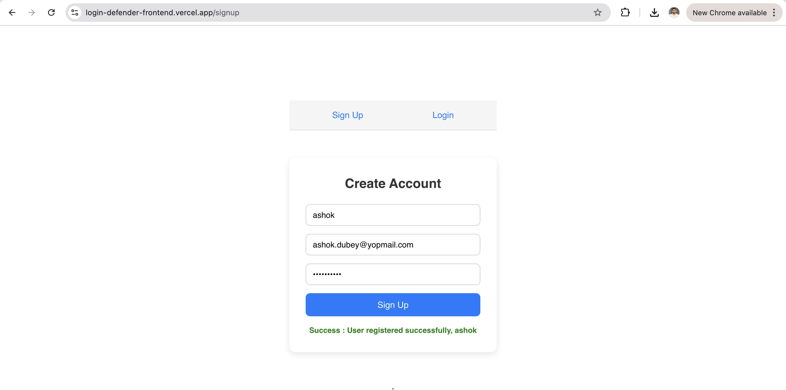
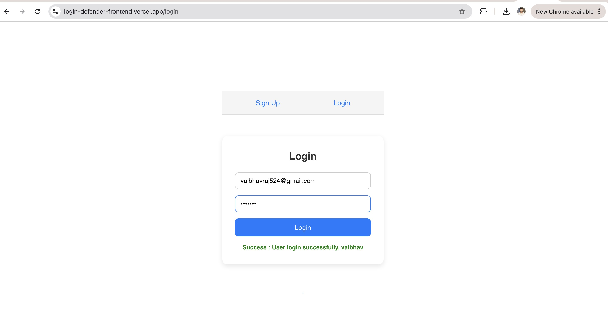
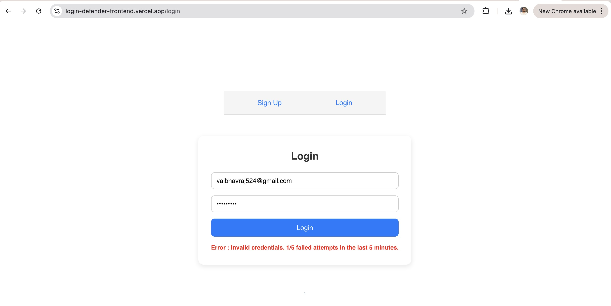
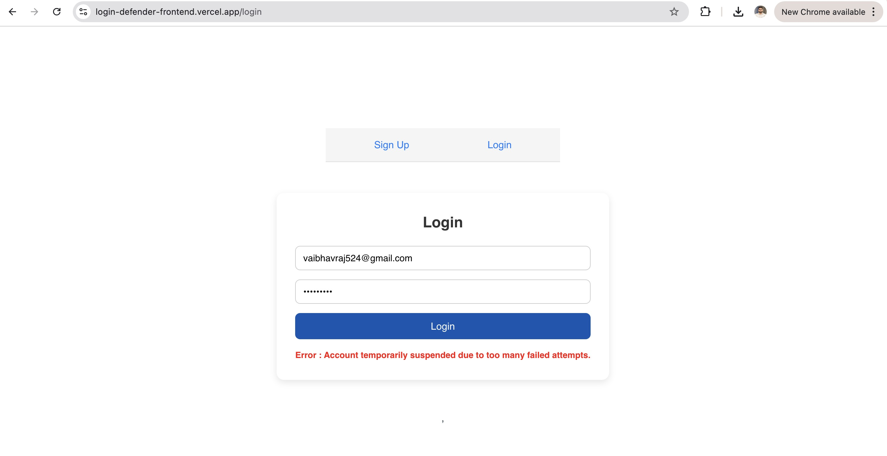
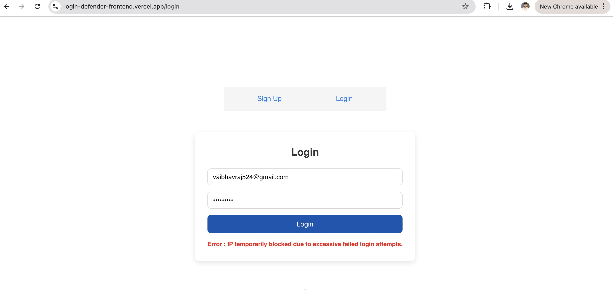

# 🧩 Brute-Force Protected Login Application (LoginRadius Assessment)

## 👤 Author

**Vaibhav Raj**
📧 [vaibhav.raj524@gmail.com](mailto:vaibhav.raj524@gmail.com)

---

## 🚀 Overview

This project implements a **secure login system** protected against **brute-force attacks** at both the **user** and **IP** levels.
It was developed as part of the **LoginRadius Take-Home Assessment**.

The application enforces:

* **User-level suspension** after repeated failed login attempts.
* **IP-level blocking** to prevent distributed brute-force attempts.
* **Persistent tracking** of failed attempts even after restarts.

---

## 🏗️ Architecture & Tech Stack

| Layer        | Technology                          |
| :----------- | :---------------------------------- |
| **Frontend** | React (Vite)                        |
| **Backend**  | Node.js (Express)                   |
| **Database** | MongoDB Atlas                       |
| **Hosting**  | Render (Backend), Vercel (Frontend) |
| **Testing**  | Jest + mongodb-memory-server        |
| **Logging**  | Winston Logger                      |

---

## 🔐 Core Features

### 1️⃣ User-Level Suspension

If a user enters the wrong password **more than 5 times within 5 minutes**, their login is **suspended for 15 minutes**.

### 2️⃣ IP-Level Blocking

If a single IP address causes **50 failed login attempts** across any users within 5 minutes, that IP is **temporarily blocked**.

### 3️⃣ Additional Highlights

* JWT-based authentication
* Configurable lockout thresholds via environment variables
* Structured logging (info, warn, error, debug)
* Health-check endpoint → `/api/v1/health`
* Persistent MongoDB-based tracking of failures and suspensions

---

## ⚙️ Environment Variables

Create a `.env` file based on `.env.example`:

```env
PORT=4000
NODE_ENV=dev
MONGO_URI=<your_mongodb_atlas_uri>
JWT_SECRET=supersecretkey
JWT_EXPIRES_IN=1d
USER_WINDOW_MINUTES=5
USER_FAILED_THRESHOLD=5
USER_SUSPEND_MINUTES=15
IP_THRESHOLD=50
IP_SUSPEND_MINUTES=60
```

---

## 🧠 Architecture Design

```plaintext
Frontend (React) → Backend (Express API) → MongoDB Atlas
                        |
                        ├── User Suspension Logic
                        ├── IP Block Logic
                        ├── JWT Auth & Validation
                        ├── Winston Logging
                        └── Unit Tests (Jest)
```

### Data Models

* **User** → Stores credentials and suspension timestamp
* **FailedLoginAttempt** → Tracks failed login attempts per user and IP
* **IPBlock** → Tracks temporarily blocked IPs

---

## ⚙️ Setup Instructions

### 🖥️ Backend Setup

```bash
git clone https://github.com/vaibhav-raj/brute-force-login-defender.git
cd brute-force-login-defender
npm install
cp .env.example .env
```

Run locally:

```bash
npm start
```

Test:

```bash
npm test
```

### 🌐 Frontend Setup

```bash
git clone https://github.com/vaibhav-raj/login-defender-frontend.git
cd login-defender-frontend
npm install
npm run dev
```

---

## 🌍 Deployment Details

| Component                | Platform | URL                                                                                      |
| :----------------------- | :------- | :--------------------------------------------------------------------------------------- |
| **Backend (API)**        | Render   | [https://loginradius.onrender.com](https://loginradius.onrender.com)                     |
| **Frontend (React App)** | Vercel   | [https://login-defender-frontend.vercel.app](https://login-defender-frontend.vercel.app) |

**Health Check URL:**

```
https://loginradius.onrender.com/api/v1/health
```

---

## 🧪 Testing

Run tests:

```bash
npm test
```

### Unit Test Coverage

* ✅ Successful login
* 🚫 User suspension after 5 failed attempts
* 🚫 IP block after 50 failed attempts
* ♻️ Clear failed attempts on successful login

Tests are implemented using **Jest** and **mongodb-memory-server** to ensure isolated and repeatable runs.

---

## 🧩 Design Decisions

* **Sliding time window** ensures fairness (`createdAt >= now - 5 min`)
* **Winston logger** for structured, consistent logs
* **MongoDB persistence** so state survives restarts
* **Environment-based configuration** for thresholds and durations
* **Centralized error handling** with a custom `AuthError` class

---

## 🤖 AI Usage Report

| Section                                              | AI Tool | Contribution                      |
| :--------------------------------------------------- | :------ | :-------------------------------- |
| **Backend Architecture & Auth Logic**                | ChatGPT | ~40% (lockout logic + IP utility) |
| **Frontend (React Login Form)**                      | ChatGPT | ~50% (layout + validation)        |
| **Test Cases (Jest)**                                | ChatGPT | ~80% (structure + logic)          |
| **Documentation (README & comments)**                | ChatGPT | ~90% (proofreading + formatting)  |
| **Manual Work (integration, debugging, deployment)** | Self    | ~8–10 hours                       |

### ⏱️ Time Summary

| Task                         | Time Spent     |
| :--------------------------- | :------------- |
| Backend & DB setup           | 4 hrs          |
| Frontend (React)             | 2 hrs          |
| Testing (Jest + mocks)       | 2 hrs          |
| Deployment (Render + Vercel) | 1 hr           |
| Documentation + AI Report    | 1 hr           |
| **Total**                    | **≈ 10 hours** |

---

## 🖼️ Screenshots

<p align="center">
  
</p>

<p align="center">
  
</p>

<p align="center">
  
</p>

<p align="center">
  
</p>

<p align="center">
  
</p>


